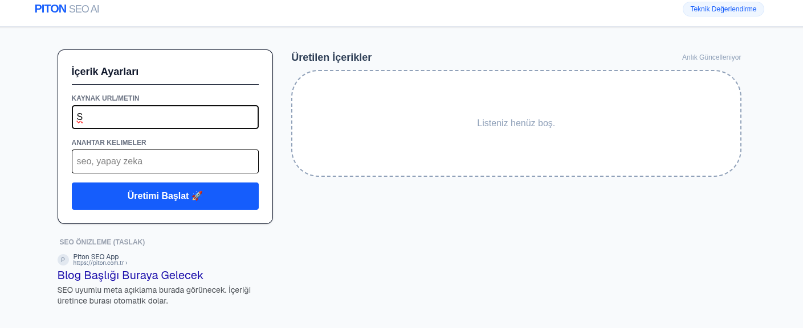
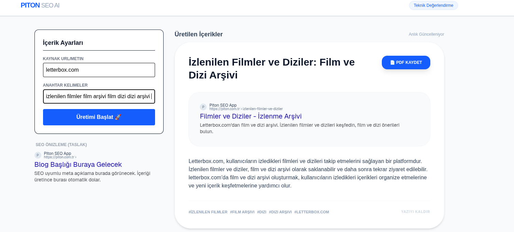
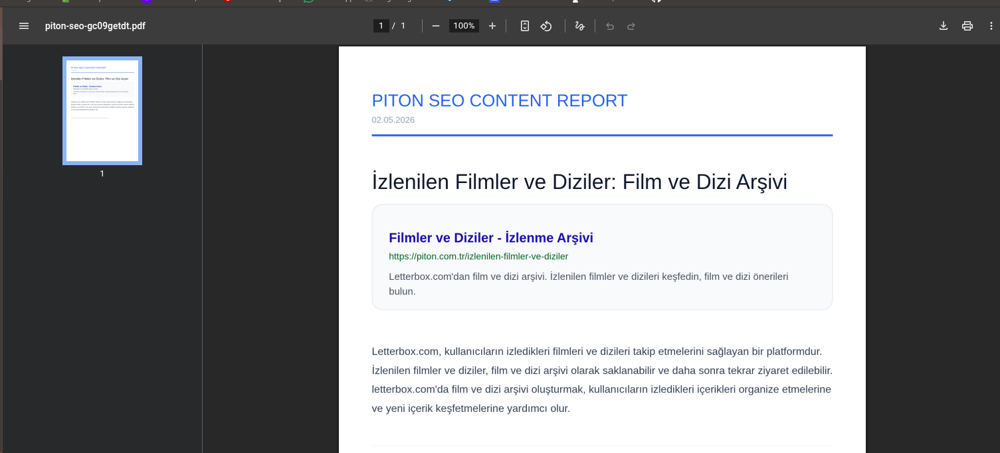

# Piton Technology - SEO & Blog Writing App

Bu uygulama, AI servislerini kullanarak belirlenen kriterlere uygun SEO uyumlu blog yazıları üreten ve yöneten bir web platformudur.

## 🚀 Öne Çıkan Özellikler
- **AI Entegrasyonu:** LLM servisleri kullanılarak içerik üretimi otomatize edilmiştir.
- **SERP Preview:** Google arama sonuçları simülasyonu ile canlı SEO önizlemesi.
- **PDF Export:** Kurumsal rapor formatında profesyonel PDF çıktısı.
- **Yönetim Paneli:** İçeriklerin özellik bazlı (feature-based) mimari ile yönetimi.

## 📸 Uygulama Ekran Görüntüleri

  ## 🎥 Uygulama Sunum Videosu

  <video src="./public/videos/videokayit.mkv" width="100%" controls>
    Tarayıcınız video etiketini desteklemiyor. Lütfen ./public/videos/ klasöründeki dosyayı manuel olarak oynatın.
  </video>

> **Not:** Şartnamede istenen yerel kurulum, kullanım senaryoları  video içerisinde gösterilmiştir

  <h3>1. İçerik Üretim ve Yapılandırma Paneli</h3>
  
   
  
<i>Kaynak girişi ve içerik ayarlarının yapıldığı ekran[cite: 1].</i>

  
  <h3>2. Google SERP Önizlemesi</h3>
  
   
  
<i>Meta verilerin arama motoru sonuçlarındaki görünümü[cite: 1].</i>

  <h3>3. PDF Rapor Çıktısı</h3>
  
   
  
<i>Üretilen içeriğin profesyonel rapor formatı.</i>

## 🏗️ Teknik Tercihler
- **Framework:** Next.js 14 & TypeScript[cite: 1].
- **State Management:** Zustand (Modülerlik ve performans için)[cite: 1].
- **Klasör Yapısı:** Feature-based (Özellik bazlı) organizasyon[cite: 1].
- **CI/CD:** GitHub Actions workflow yapılandırması[cite: 1].

## 📦 Kurulum ve Çalıştırma
1. Paketleri yükleyin: `npm install`[cite: 1]
2. `.env.local` dosyasını oluşturup AI anahtarınızı ekleyin[cite: 1].
3. Projeyi başlatın: `npm run dev`[cite: 1]
